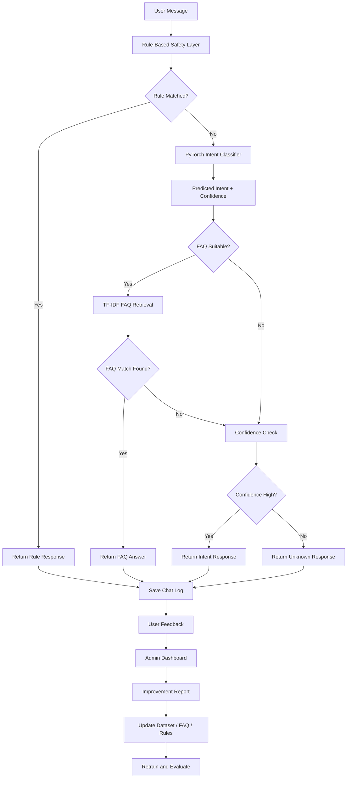

# Offline PyTorch NLP Chatbot

An offline NLP chatbot built using **PyTorch** and classical NLP techniques. The chatbot is trained from scratch without using LLMs, API keys, or pretrained models.

The project includes intent classification, rule-based safety handling, TF-IDF FAQ retrieval, Streamlit UI, FastAPI backend, SQLite logging, feedback collection, admin dashboard, model evaluation, and a custom LSTM classifier.

---

## Project Objective

The goal of this project is to build a practical offline chatbot that can answer product-related questions, guide users to the correct feature, handle common support queries, and improve over time using feedback data.

This project is designed as a portfolio-ready machine learning and NLP project for demonstrating:

* NLP preprocessing
* PyTorch model training
* Intent classification
* TF-IDF based retrieval
* Rule-based safety handling
* API development using FastAPI
* UI development using Streamlit
* SQLite logging and feedback collection
* Model evaluation and improvement workflow
* Custom LSTM model training from scratch

---

## Key Features

* Offline chatbot with no external API dependency
* No LLMs, no API keys, no pretrained models
* Custom PyTorch intent classifier trained from scratch
* Bag-of-Words neural network model
* Custom LSTM intent classifier with trainable embeddings
* Rule-based safety layer for sensitive and abusive content
* Shortcut rules for common messages like hi, bye, help, price, ok
* Fuzzy matching for small spelling mistakes
* TF-IDF FAQ retrieval for local product/support questions
* Confidence-based fallback for unknown questions
* Terminal chatbot interface
* Streamlit chat UI for portfolio demo
* FastAPI backend for API integration
* SQLite database logging
* Helpful / not helpful feedback collection
* Admin dashboard for monitoring chatbot performance
* Evaluation scripts with accuracy, unknown rate, and wrong prediction report
* Feedback-based improvement report generation
* Model comparison between Bag-of-Words and LSTM classifiers

---

## Tech Stack

| Area                 | Technology                                   |
| -------------------- | -------------------------------------------- |
| Programming Language | Python                                       |
| Deep Learning        | PyTorch                                      |
| NLP                  | Tokenization, stemming, Bag-of-Words, TF-IDF |
| ML Utilities         | NumPy, scikit-learn                          |
| UI                   | Streamlit                                    |
| Backend API          | FastAPI                                      |
| Server               | Uvicorn                                      |
| Database             | SQLite                                       |
| Data Format          | JSON                                         |
| Dashboard            | Streamlit + Pandas                           |

---

## System Architecture



---

## Models Used

### 1. Bag-of-Words Feed Forward Neural Network

The first model converts user text into a Bag-of-Words vector and classifies the intent using a feed-forward neural network.

Flow:

```text
Text → Tokenization → Stemming → Bag of Words → Neural Network → Intent
```

### 2. LSTM Intent Classifier

The second model uses a custom LSTM network trained from scratch. It uses a trainable embedding layer and does not use any pretrained embeddings.

Flow:

```text
Text → Token IDs → Embedding Layer → LSTM → Fully Connected Layer → Intent
```

---

## Dataset

The project uses local JSON files.

### `data/intents.json`

Contains intent categories, training patterns, and predefined responses.

Example intents:

* greetings
* goodbye
* thanks
* product_info
* pricing
* support
* complaint
* bot_identity
* bot_capability
* sensitive_content
* abusive_language
* unknown

### `data/faq.json`

Contains local FAQ questions and answers used by the TF-IDF retrieval system.

Example categories:

* account
* pricing
* features
* support
* billing
* security

### `data/test_questions.json`

Contains test messages and expected intents for evaluating chatbot accuracy.

---

## Installation

### 1. Clone the repository

```bash
git clone https://github.com/your-username/offline-pytorch-nlp-chatbot.git
cd offline-pytorch-nlp-chatbot
```

### 2. Create virtual environment

For Windows:

```bash
python -m venv venv
venv\Scripts\activate
```

For Mac/Linux:

```bash
python -m venv venv
source venv/bin/activate
```

### 3. Install dependencies

```bash
pip install -r requirements.txt
```

---

## Training

### Train Bag-of-Words model

```bash
python src/train.py
```

This creates:

```text
model/chatbot_model.pth
```

### Train LSTM model

```bash
python src/train_lstm.py
```

This creates:

```text
model/lstm_chatbot_model.pth
```

---

## Running the Chatbot

### Terminal chatbot

```bash
python src/chat.py
```

### LSTM terminal chatbot

```bash
python src/chat_lstm.py
```

---

## Streamlit Chat UI

```bash
streamlit run app/streamlit_app.py
```

The UI includes:

* Chat interface
* Bot responses
* Source information
* Intent prediction
* Confidence score
* FAQ match score
* Debug details

---

## FastAPI Backend

Run the API server:

```bash
uvicorn api.main:app --reload
```

Open Swagger UI:

```text
http://127.0.0.1:8000/docs
```

Example request:

```json
{
  "message": "how do i reset my password",
  "include_debug": true
}
```

Example response:

```json
{
  "reply": "You can reset your password by clicking Forgot Password on the login page and following the instructions.",
  "log_id": 1,
  "intent": "support",
  "confidence": 0.82,
  "source": "faq_retrieval",
  "faq_match_score": 0.91,
  "faq_question": "How do I reset my password?"
}
```

---

## Admin Dashboard

Run:

```bash
streamlit run app/admin_dashboard.py
```

The dashboard shows:

* Total chat logs
* Helpful vs not helpful feedback
* Unknown rate
* Average confidence
* Source breakdown
* Intent distribution
* Recent chat logs
* Not helpful responses
* Unknown / low-confidence messages
* CSV export
* Improvement candidates

---

## Evaluation

### Evaluate Bag-of-Words model

```bash
python src/evaluate.py
```

### Evaluate LSTM model

```bash
python src/evaluate_lstm.py
```

### Compare both models

```bash
python scripts/compare_models.py
```

Evaluation includes:

* Total test questions
* Correct predictions
* Wrong predictions
* Accuracy
* Unknown rate
* Source breakdown
* Intent breakdown
* Confusion matrix

---

## Feedback-Based Improvement Workflow

The chatbot logs user interactions and feedback in SQLite.

Generate improvement report:

```bash
python scripts/generate_improvement_report.py
```

This creates:

```text
data/improvement_candidates.json
```

Improvement workflow:

1. Collect chat logs and feedback
2. Review not-helpful and low-confidence messages
3. Generate improvement candidates
4. Add missing examples to `data/intents.json`
5. Add missing FAQ answers to `data/faq.json`
6. Improve rules in `src/rules.py`
7. Retrain the model
8. Run evaluation
9. Test again

---

## Screenshots

Add screenshots in the `screenshots/` folder.

Recommended screenshots:

```text
screenshots/streamlit_chat_ui.png
screenshots/fastapi_docs.png
screenshots/admin_dashboard.png
screenshots/evaluation_report.png
```

Then display them in README:

<!-- ```markdown
## Streamlit Chat UI


## FastAPI Docs


## Admin Dashboard


## Evaluation Report


```

--- -->

## Example Questions

Try asking:

```text
hi
what can you do
are you a human
how do i reset my password
how do i contact support
how much does the product cost
where can i see my billing details
i need medical help
you are stupid
random qwerty text
```

---

## Project Highlights

This project demonstrates an end-to-end offline chatbot system:

* Local model training
* Local inference
* No external AI API
* No LLM dependency
* Rule-based safety handling
* Retrieval-based FAQ answering
* Evaluation and monitoring
* Feedback loop for improvement
* API and UI integration

---
