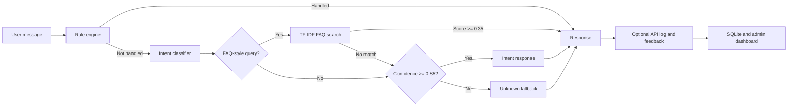

# Offline PyTorch NLP Chatbot

An end-to-end, fully local NLP chatbot built with PyTorch. It combines intent classification, TF-IDF FAQ retrieval, confidence-based fallback, a rule-engine hook, a Streamlit chat interface, a FastAPI service, and SQLite-backed monitoring—without an LLM, an API key, or a pretrained language model.

## What this project demonstrates

- Training text classifiers from scratch with PyTorch
- Bag-of-Words and LSTM intent-classification approaches
- Local FAQ retrieval with TF-IDF and cosine similarity
- Confidence-aware routing and unknown-query fallback
- Interactive chat and monitoring interfaces with Streamlit
- REST API development with FastAPI and Pydantic
- Chat logging and feedback collection with SQLite
- Offline evaluation and model comparison

## How it works



The default application uses the Bag-of-Words classifier in `src/chat.py`. A separate LSTM implementation is available in `src/chat_lstm.py` for comparison.

## Features

| Area | Included |
| --- | --- |
| Intent models | Feed-forward Bag-of-Words model and custom LSTM model |
| Retrieval | TF-IDF FAQ search with cosine similarity |
| Routing | Rule hook, FAQ routing, `0.85` model-confidence fallback |
| Interfaces | Terminal chat and Streamlit chat UI |
| API | FastAPI chat, feedback, log, summary, and health endpoints |
| Persistence | SQLite chat logs and user feedback |
| Monitoring | Streamlit admin dashboard and CSV export |
| Evaluation | Accuracy, unknown rate, source distribution, errors, and confusion counts |
| Privacy | Local inference; no external AI service or API key |

## Tech stack

- Python 3.13+
- PyTorch
- NumPy and scikit-learn
- NLTK Porter stemmer (no corpus download required)
- FastAPI, Pydantic, and Uvicorn
- Streamlit and Pandas
- SQLite
- `uv` for dependency management

## Repository layout

```text
NLP-chatbot/
├── api/
│   └── main.py                  # FastAPI application
├── app/
│   ├── streamlit_app.py         # Chat interface
│   └── admin_dashboard.py       # Logs and feedback dashboard
├── data/
│   ├── intents.json             # Intent patterns and responses
│   ├── faq.json                 # Local FAQ knowledge base
│   └── test_questions.json      # Evaluation examples
├── model/
│   ├── chatbot_model.pth        # Bag-of-Words checkpoint
│   └── lstm_chatbot_model.pth   # LSTM checkpoint
├── scripts/
│   ├── compare_models.py
│   ├── generate_improvement_report.py
│   └── retrain_and_evaluate.py
├── src/
│   ├── chat.py                  # Default inference pipeline and CLI
│   ├── chat_lstm.py             # LSTM inference pipeline and CLI
│   ├── database.py              # SQLite storage helpers
│   ├── evaluate.py              # Bag-of-Words evaluation
│   ├── evaluate_lstm.py         # LSTM evaluation
│   ├── model.py                 # Feed-forward network
│   ├── lstm_model.py            # LSTM network
│   ├── nltk_utils.py            # Tokenization, stemming, Bag-of-Words
│   ├── retrieval.py             # TF-IDF FAQ retriever
│   ├── rules.py                 # Rule-engine module
│   ├── train.py                 # Bag-of-Words training
│   └── train_lstm.py            # LSTM training
├── pyproject.toml
└── uv.lock
```

The checked-in datasets currently contain 15 intents, 20 FAQ entries, and 53 evaluation questions.

## Getting started

### Prerequisites

- [Python 3.13 or newer](https://www.python.org/downloads/)
- [`uv`](https://docs.astral.sh/uv/getting-started/installation/) (recommended)

### Install

```bash
git clone https://github.com/falsii/NLP-chatbot.git
cd NLP-chatbot
uv sync
```

The trained model checkpoints are included, so retraining is not normally required before running the application.

If you prefer `pip`, create and activate a virtual environment, then install the project dependencies from `pyproject.toml`:

```bash
python -m venv .venv

# Windows PowerShell
.venv\Scripts\Activate.ps1

# macOS/Linux
source .venv/bin/activate

python -m pip install -e .
```

## Run the project

### Streamlit chat UI

```bash
uv run streamlit run app/streamlit_app.py
```

Streamlit prints the local application URL, normally `http://localhost:8501`.

### Terminal chatbot

```bash
uv run python src/chat.py
```

Type `quit` or `exit` to close the session.

### LSTM terminal chatbot

```bash
uv run python src/chat_lstm.py
```

### FastAPI service

```bash
uv run uvicorn api.main:app --reload
```

Useful URLs:

- API documentation: `http://127.0.0.1:8000/docs`
- Health check: `http://127.0.0.1:8000/health`

### Admin dashboard

```bash
uv run streamlit run app/admin_dashboard.py
```

The API and admin dashboard create `database/chatbot_logs.db` automatically when needed.

## API reference

| Method | Path | Purpose |
| --- | --- | --- |
| `GET` | `/` | Basic service status |
| `GET` | `/health` | Model readiness check |
| `POST` | `/chat` | Generate a reply and save the interaction |
| `POST` | `/feedback` | Attach feedback to a chat log |
| `GET` | `/logs?limit=50` | Return recent chat logs (`1`–`200`) |
| `GET` | `/feedback-summary` | Return feedback, source, and intent counts |

Example chat request:

```bash
curl -X POST http://127.0.0.1:8000/chat \
  -H "Content-Type: application/json" \
  -d '{"message":"How do I reset my password?","include_debug":true}'
```

Example response shape:

```json
{
  "reply": "You can reset your password by clicking Forgot Password on the login page and following the instructions.",
  "log_id": 1,
  "intent": "support",
  "confidence": 0.92,
  "source": "faq_retrieval",
  "faq_match_score": 1.0,
  "faq_question": "How do I reset my password?"
}
```

Submit feedback using the returned `log_id`:

```bash
curl -X POST http://127.0.0.1:8000/feedback \
  -H "Content-Type: application/json" \
  -d '{"log_id":1,"feedback":"helpful","feedback_comment":"Solved my issue"}'
```

`feedback` must be either `helpful` or `not_helpful`.

## Training

Train the default Bag-of-Words model:

```bash
uv run python src/train.py
```

Train the LSTM model:

```bash
uv run python src/train_lstm.py
```

The scripts write their checkpoints to `model/chatbot_model.pth` and `model/lstm_chatbot_model.pth`. Both training pipelines use deterministic seeds and an 80/20 train-validation split.

## Evaluation

```bash
# Evaluate the Bag-of-Words model
uv run python src/evaluate.py

# Evaluate the LSTM model
uv run python src/evaluate_lstm.py

# Run both evaluations
uv run python scripts/compare_models.py

# Retrain and evaluate the default model
uv run python scripts/retrain_and_evaluate.py
```

Evaluation reads `data/test_questions.json` and reports accuracy, unknown rate, response-source counts, predicted-intent counts, incorrect predictions, and confusion counts.

## Customize the chatbot

- Add or revise intent examples and responses in `data/intents.json`, then retrain the selected model.
- Add product or support answers to `data/faq.json`. The TF-IDF index is rebuilt when the chatbot starts, so FAQ-only edits do not require model training.
- Adjust FAQ similarity in `src/retrieval.py` and model confidence thresholds in `src/chat.py` or `src/chat_lstm.py`.
- Extend `src/rules.py` for deterministic safety, identity, or shortcut behavior.
- Add evaluation cases to `data/test_questions.json` before comparing model changes.

Example questions to try:

```text
hi
what can you do
are you a human
how do I reset my password
how do I contact support
how much does the product cost
where can I see my billing details
random qwerty text
```

## Current repository status

The current `master` snapshot is a work in progress:

- `src/rules.py` is empty, while both inference pipelines import `apply_rules`; application startup currently fails until that function is restored or implemented.
- `tests/test_chatbot.py` is an empty test scaffold.
- `scripts/generate_improvement_report.py` currently duplicates the retrain/evaluate workflow and does not generate `data/improvement_candidates.json`.

These gaps are documented here so setup failures are not mistaken for dependency or model-checkpoint problems.

## License

No license file is currently included. Add a license before redistributing or accepting external contributions.
